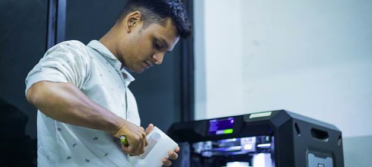
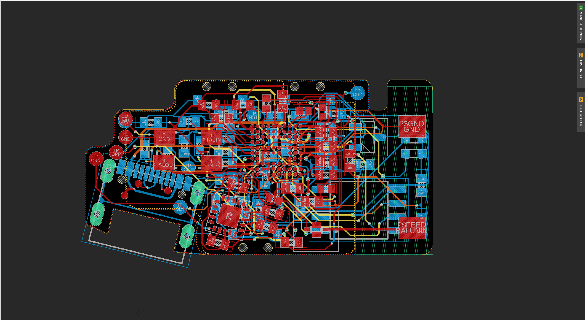
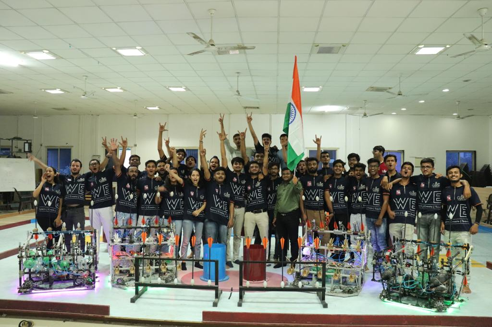

857-313-0460 | [mewada.y@northeastern.edu](mailto:mewada.y@northeastern.edu) | [LinkedIn](https://www.linkedin.com/in/yashmewada/) | [GitHub](https://github.com/yashmewada9618)  
  

Hi! I am Yash Mewada, a Graduate Student at Northeastern University. I did my BSc. in Instrumentation and Control Engineering from Gujarat, India in 2022 and currently pursuing MSc in Robotics with an Electrical and Computer Engineering Concentration. I became inclined toward Robotics and Automation during my undergrad where I was a part of my university’s robotics club for over 3 years and there I served as both a Technical Core Electronics member and a Management member. I am a self-taught and progress dirven person. During the tenure of 3 years, I learned and implemented control systems and autonomous and semi-autonomous robots. My goal is to continue learning and growing throughout my career which is why I came to Boston to pursue my Master's.
My research is in Probabilistic Robotics i.e SLAM, Motion Planners, and Autonomous Navigation i.e the technologies and methodologies that make Autonomous Mobile Robots AUTONOMOUS. I have a deep passion for such technologies and which is why I am constantly learning and exploring these areas. Fun fact about me: I believe in taking risks - this also helps my “Can do” attitude!

# EDUCATION
**Northeastern University** - Boston,MA  
*Master of Science in Robotics (EECE)* - May (2024)  
Coursework in Mobile Robotics, Robot Mechanics and Control, Robot sensing and Navigation, and Computer Vision.  
The course work in Mobile Robotics and Robot Mechanics and Control honed my knowledge about Kinematics, Motion Models, Lie Groups & Manifolds, and SLAM whereas Robot Sensing and Navigation and Computer Vision did a part in converting the methodologies from Mobile Robotics and Robot Mechanics and Control courses into practicalities. 
GPA: 3.8 / 4.0.

**Vishwakarma Government Engineering College** - Ahmedabad,IN  
*B. Tech in Instrumentation and Control Engineering* - June 2022  
Learned and imeplemented concepts of Control Systems and Industrial Instrumentation.  
GPA: 3.9 / 4.0.

# SKILLS

**Programming Languages:** C, C++, Python, MATLAB.  
**Embedded Controllers:** STM32(Intermediate Level experience) and other ARM/AVR Boards, Intel NUC i7 + 2060 GPU  
**Additional Skills:** SLAM, OpenCV, Image Processing Techniques, Experience in the development and implementation of machine learning software (Preferably with TensorFlow), Control Systems, Shell Script, ROS, Autodesk Eagle, Autodesk Fusion 360.  
**Interests:** Robotics, Machine Perception, and Control, Motion Planning, Computer Vision, Probability, and Statistics.  

# RESEARCH EXPERIENCE

**Northeastern University** - Boston,MA  
*Research Volunteer at Autonomy & Intelligence Laboratory* - December 2022 – Present  
Here we are working on High vehicle speed and off-road environments each presenting exciting challenges for modern autonomy pipelines. To achieve high speed, the algorithms must quickly reason about the massive amount of data coming from various sensor streams. To navigate off-road, it is critical to understand both the geometry and semantics of the scene (e.g., a robot may be able to drive through soft bushes but not a fallen log). Our work is focused on learning a cost-to-go estimator to enable aggressively, online model predictive control (MPC)-based motion planning. 
This research work is conducted under the guidance of Prof. Michael Everett from Electrical and Computer Engineering Department at Northeastern Unviersity.  
* Research work on High-Speed, off-road Autonomy in robots using online MPC (Model Predictive Control) based motion planning.
* Development of robots for collision avoidance in pedestrian-rich environments using MPR-RL motion planning.

**Northeastern University** - Boston, MA  
*Project work for Mobile Robotics* - September 2022 – December 2022  
We were given a task for autonomous reconnaissance in a disaster site where the robot enters the site without any prior knowledge of it and then maps the environment and also detects the victims, in this case, April Tags. Then the rescuers with the help of this best-approximated information will perform the reconnaissance. Gmapping was used in this case for mapping the environment due to its lightweight and less complex math behind it (RBPF algorithm). To ensure complete map generation and detection all the April tag RRT-based frontier exploration was used for autonomous exploration and camera calibration was performed.
A detailed report regarding this can be found on my GitHub under the repo named Team Splinter.  
* 15 April Tags were used as victims and the robot was able to detect those victims’ poses with respect to the world frame.

**Gujarat Technological University** - Ahmedabad, IN  
*Research Scholar* - October 2021 – February 2022  
We developed and designed a closed loop motor driver similar to that of the Polulu-Roboclaw 45Amp DC motor driver with autotune and PID calibration routines during startup for 4 DC motors of Omni Wheeled drive robot and also studied how PID and Autotune PID algorithms like Ziegler-Nichols and Cohen-Coon tuning works. 

  

# WORK EXPERIENCE
**Studio Carbon** - Gandhinagar, IN  
*Embedded Engineer Intern* - March 2022 - September 2022  
* Collaborate with the Industrial design team to develop a "smart fitness device" as a major project.
* Spearheaded a smart fitness device and handled it from ideation to prototyping and batch production level as a team of 5.

**WeHear Hearing Solutions** - Ahmedabad, IN  
*Embedded R&D Intern* - January 2019 - July 2019  
We designed and developed a BLE-based Hearing Aid for hearing impaired people. This device had a small MEMS mic which was digitally controlled. This device was made small and compact so that it could be worn as a watch. A BLE microcontoller was used here which did the part of encoding the digital sound from the mic and transmitting it to the host bluetooth earphones.
* Developed Spectral Analysis devices for drug authentication and verification and tested around 50 different drugs with 89% accuracy.

# ACTIVITIES
**Northeastern University Robotics Club** - Boston, MA  
*Technical Core Team Member* - September 2022 - Present  
* Coordinating on Computer-vision, and motion planning-related tasks of an open-source 4-legged robot.

  
**Gujarat Technological University Robotics Club** - Ahmedabad, IN  
*Management and Technical Core Team Member (EECE)* - August 2019 - September 2022  
This is the place where it all started. For a tenure of 1 year (2019 - 2020) I was a part of a small software group with a team of 45 members. I was responsible for programming the robot, actuating its actuators on time, making the robot perform the tasks as per the theme given by the host country, and completing the task within the time frame of 3 mins. Here we implemented and also made use of smart closed-loop motor drivers. For the second year, we mentored a team of 45 members by providing them with training in basic robotics (electronics and mechanical). This year we implemented PID control on IMU and wheel odometry for robot motion and used Free-RTOS to control various actuators of the robot. Programmed a Swerve Drive robot and designed an in-house VNH-5019-based motor driver. Also, statistical learning was implemented in arrow throwing as per the theme.  
More details about our work and club can be found here : https://www.youtube.com/@GTUROBOTICSCLUB
* Secured 3rd rank out of 32 domestic teams and was awarded the best design award by Toyota Motors (2020).
* Acquired 10th rank at the National Level ABU-Robocon 2022.
* Secured 2nd rank out of 28 teams in domestic and 7th out of 21 teams in ABU Robocon 2021, China.
